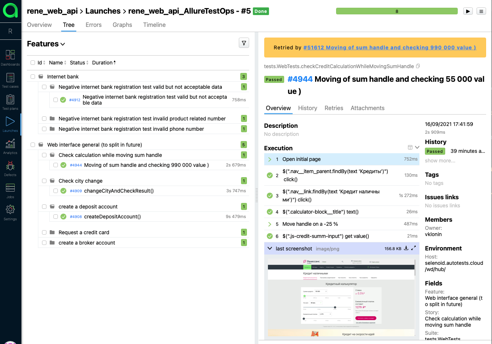
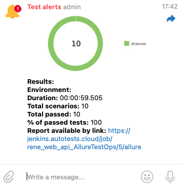
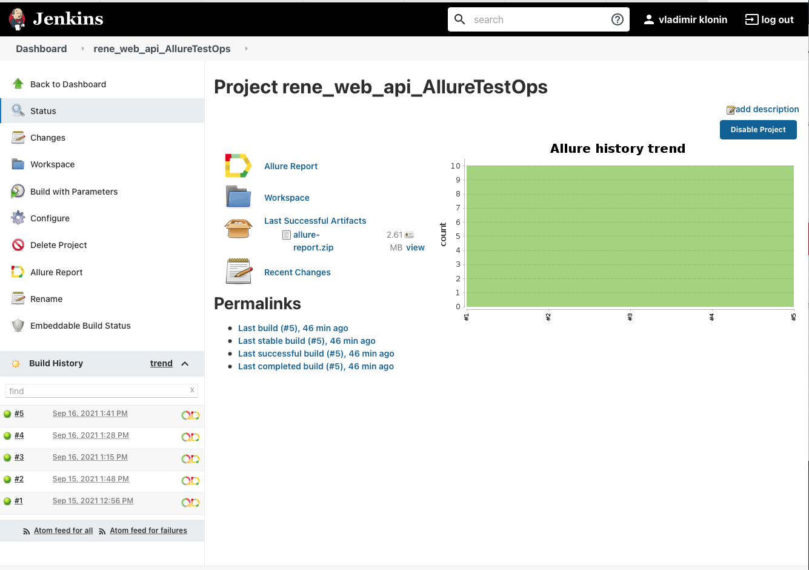
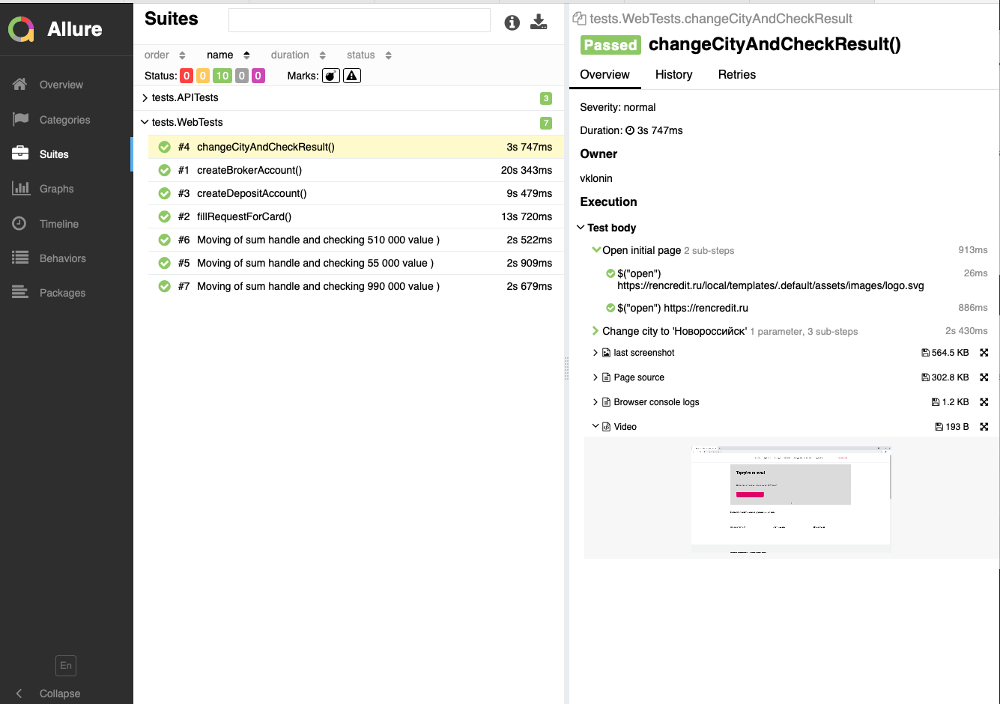

# Autotests for renecredit
___
## Stack
| GitHub | IntelliJ IDEA | Java | Gradle | Junit5 | Selenide |
|:------:|:----:|:----:|:------:|:------:|:--------:|
|  |  |  |  |  |  |

| Jenkins | Selenoid | Allure Report | 
|:--------:|:-------------:|:---------:|
|  |  |  | 
___

## Run tests in Jenkins Default parameters [Build](https://jenkins.autotests.cloud/job/rene_web_api_AllureTestOps/build?delay=0sec)
* REMOTE_DRIVER_URL (url address from selenoid default selenoid.autotests.cloud)
* ALLURE_NOTIFICATIONS_VERSION (default 3.0.1)
* credentials passed through a Jenkins job (used Owner Java library to get them from .properties)

## Jenkins job [Jenkins](https://jenkins.autotests.cloud/job/rene_web_api_AllureTestOps/) 

## Allure TestOps project [link to a Launch](https://allure.autotests.cloud/launch/6498/tree/51610?treeId=956)

## Telegram channel to look at results [(Telegram channel)](https://t.me/joinchat/d7-KKDr_A4FjMjM6)

## Results in Jenkins

## Allure Reports

## Test results video attachment example from Selenoid
